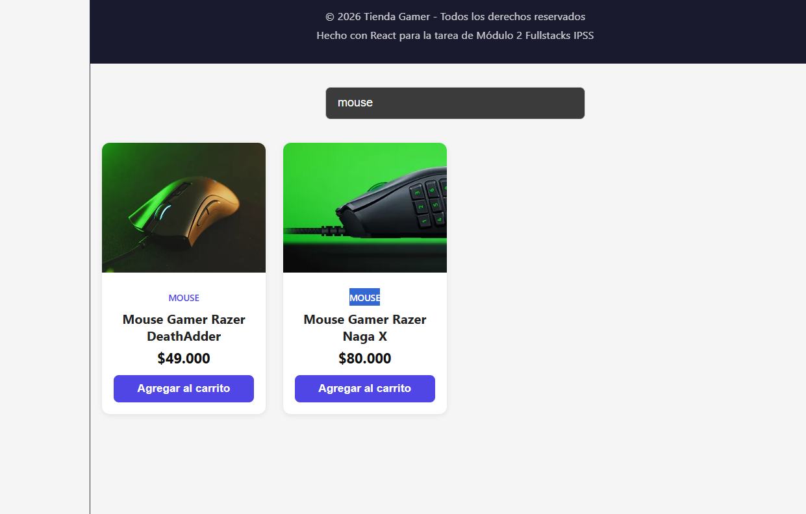

# Ecommerce Components

E-commerce básico orientado a "Tienda Gamer" desarrollado con React + Vite.

Proyecto de práctica del Módulo 2 (Fullstacks) enfocado en la creación de componentes reutilizables, props, estado con `useState` y renderizado de listas.

## Demo en vivo

🔗 [https://ecommerce-components-five.vercel.app](https://ecommerce-components-five.vercel.app)

## Componentes creados

- **Header** → Logo + nombre de la tienda
- **SearchBar** → Input controlado con `useState` para filtrar productos
- **ProductCard** → Muestra nombre, precio, imagen y categoría (recibe props)
- **ProductList** → Renderiza la lista de productos usando `.map()` y `key`
- **Button** → Botón reutilizable (variantes `primary` / `secondary`)
- **Footer** → Información básica del proyecto

## Cómo ejecutar el proyecto

```bash
# 1. Clonar el repositorio
git clone https://github.com/JavierVargasGH/ecommerce-components.git

# 2. Entrar a la carpeta
cd ecommerce-components

# 3. Instalar dependencias
npm install

# 4. Ejecutar en modo desarrollo
npm run dev


Tecnologías utilizadas

React 19
Vite
CSS (sin frameworks)
JavaScript (ES6+)

## Capturas de pantalla

### Vista general del e-commerce


### Listado de productos


